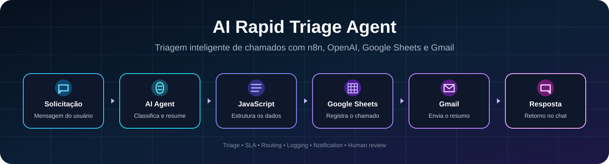
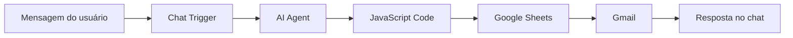

<p align="center">
  
</p>

<h1 align="center">AI Rapid Triage Agent</h1>

<p align="center">
  Workflow no n8n que recebe solicitações de suporte, utiliza inteligência artificial para fazer a primeira triagem, registra o ticket no Google Sheets e envia um resumo ao analista por e-mail.
</p>

<p align="center">
  
  
  
  
  
  <a href="https://github.com/cmosantos/ai-rapid-triage-agent-n8n/actions/workflows/tests.yml">
    
  </a>
</p>

---

## Entenda em 30 segundos

Este projeto funciona como um **assistente de primeira triagem** para o suporte de TI.

O usuário escreve o problema no chat. A IA organiza a solicitação, identifica categoria, prioridade, risco e impacto. Depois, o workflow registra os dados em uma planilha, envia um resumo ao analista e devolve uma resposta no chat.

Em uma frase:

> O workflow recebe uma solicitação de suporte, usa IA para fazer a primeira análise, registra o chamado e avisa o analista.

A IA não encerra o atendimento sozinha. A decisão final continua com uma pessoa.

---

## Visão geral

O AI Rapid Triage Agent foi criado para demonstrar como agentes de IA e automações podem apoiar operações de Help Desk e Service Desk.

Em vez de o analista começar lendo mensagens desorganizadas e decidindo manualmente cada informação, o workflow entrega uma primeira análise estruturada com:

- título do chamado;
- resumo do problema;
- categoria;
- prioridade;
- risco de segurança;
- impacto no negócio;
- ações técnicas recomendadas;
- resposta sugerida ao usuário;
- nota técnica interna;
- necessidade de revisão humana.

O node em JavaScript complementa a análise com:

- identificador automático do ticket;
- data e hora;
- meta de SLA;
- fila responsável;
- necessidade de escalonamento;
- status inicial.

---

## Valor para o negócio

O workflow demonstra como reduzir tarefas repetitivas na primeira etapa do suporte:

- padronizar a classificação dos chamados;
- reduzir o tempo da triagem inicial;
- identificar solicitações que exigem escalonamento;
- sugerir ações para o analista;
- registrar os dados automaticamente;
- melhorar a rastreabilidade dos tickets;
- manter revisão humana em situações críticas.

---

## Arquitetura



### O papel de cada etapa

| Etapa | Função |
|---|---|
| Chat Trigger | Recebe a solicitação do usuário |
| AI Agent | Analisa, classifica e resume o problema |
| OpenAI Chat Model | Fornece o modelo de linguagem ao agente |
| JavaScript Code | Limpa a resposta e cria campos operacionais |
| Google Sheets | Registra os dados do ticket |
| Gmail | Envia o resumo ao analista |
| Chat Response | Apresenta o resultado da triagem |

Uma explicação ainda mais simples está em [`docs/entenda-o-projeto.md`](./docs/entenda-o-projeto.md).

---

## Exemplo de uso

### Solicitação recebida

```text
Não consigo acessar o e-mail corporativo. Minha conta parece bloqueada e não estou recebendo o código do MFA.
```

### Resultado esperado

```text
Ticket Title: Acesso ao e-mail corporativo bloqueado
Category: Password / MFA
Priority: High
Security Risk: Medium
SLA: 4 hours
Assigned Queue: Identity & Access Support
Needs Human Review: Yes
Escalation Required: Yes
Status: New
```

---

## Categorias reconhecidas

- Microsoft 365;
- Exchange Online;
- Microsoft Teams;
- Entra ID / Azure AD;
- Password / MFA;
- Device / Hardware;
- Network / VPN;
- AWS / IAM;
- Security / Phishing;
- Access Request;
- Software / Application;
- Other.

---

## Regras de prioridade e SLA

| Prioridade | Uso esperado | SLA definido no workflow |
|---|---|---|
| Critical | Incidente grave, indisponibilidade, comprometimento ou exposição | 1 hora |
| High | Usuário impedido de trabalhar | 4 horas |
| Medium | Impacto parcial | 1 dia útil |
| Low | Dúvida ou solicitação sem urgência | 3 dias úteis |

---

## Regras de encaminhamento

| Categoria identificada | Fila sugerida |
|---|---|
| Microsoft 365, Exchange ou Teams | Microsoft 365 Support |
| Entra ID, senha, MFA ou acesso | Identity & Access Support |
| AWS ou IAM | Cloud IAM Support |
| Segurança ou phishing | Security Operations |
| Rede ou VPN | Network Support |
| Dispositivo ou hardware | Field Support |
| Software ou aplicação | Application Support |
| Outras situações | General IT Support |

---

## Tecnologias

| Tecnologia | Uso no projeto |
|---|---|
| n8n | Orquestração visual do workflow |
| OpenAI Chat Model | Interpretação da solicitação |
| AI Agent | Aplicação das regras de triagem |
| JavaScript | Tratamento e enriquecimento dos dados |
| Google Sheets | Registro dos tickets |
| Gmail | Notificação ao analista |
| GitHub Actions | Validação automática do template público |

---

## Como reproduzir

### 1. Importe o workflow

No n8n, importe o arquivo:

```text
workflow/ai-rapid-triage-agent.json
```

### 2. Configure suas credenciais

Selecione suas próprias conexões nos nodes:

- OpenAI Chat Model;
- Google Sheets;
- Gmail.

### 3. Prepare a planilha

Crie uma aba chamada `Tickets` com as colunas descritas em [`docs/configuracao.md`](./docs/configuracao.md).

### 4. Substitua os placeholders

No node do Google Sheets, informe o ID da sua planilha.

No node do Gmail, substitua:

```text
analyst@example.com
```

pelo endereço que receberá os resumos.

### 5. Execute um teste

Abra o chat do n8n, envie uma solicitação e confira:

- resposta do agente;
- nova linha na planilha;
- recebimento do e-mail;
- prioridade, SLA e fila sugerida.

O passo a passo completo está em [`docs/configuracao.md`](./docs/configuracao.md).

---

## Segurança do template público

O arquivo disponibilizado neste repositório foi preparado para compartilhamento público.

Foram removidos:

- IDs reais de credenciais;
- ID e URL da planilha particular;
- endereço pessoal de destino;
- identificadores da instância do n8n.

O workflow utiliza placeholders e exige que cada pessoa configure suas próprias conexões após a importação.

---

## Validação automática

O repositório possui testes em Python que verificam:

- se o JSON do workflow é válido;
- se todos os nodes essenciais existem;
- se nenhuma credencial foi incorporada ao arquivo;
- se os placeholders públicos estão presentes;
- se o workflow está inativo por padrão;
- se as conexões principais estão definidas.

Para executar localmente:

```bash
python -m unittest discover -s tests -v
```

O GitHub Actions realiza essa validação automaticamente em cada alteração na branch `main`.

---

## Estrutura do repositório

```text
ai-rapid-triage-agent-n8n/
├── .github/
│   └── workflows/
│       └── tests.yml
├── assets/
│   └── ai-rapid-triage-banner.svg
├── docs/
│   ├── configuracao.md
│   └── entenda-o-projeto.md
├── screenshots/
├── tests/
│   └── test_workflow.py
├── workflow/
│   └── ai-rapid-triage-agent.json
├── project-summary.md
├── setup-guide.md
├── workflow-overview.md
└── README.md
```

---

## Limitações atuais

- não está integrado a uma plataforma ITSM real;
- utiliza Google Sheets como registro simplificado;
- o e-mail é enviado em todas as execuções;
- a classificação depende da interpretação do modelo;
- não existe base de conhecimento conectada;
- não há processo formal de aprovação;
- o analista deve revisar as decisões relevantes.

---

## Próximas evoluções

- enviar alertas somente para tickets críticos ou escalados;
- criar aprovação para solicitações de acesso;
- integrar Microsoft Teams;
- gerar dashboard de categorias, prioridades e SLA;
- conectar uma base de conhecimento;
- integrar Jira, ServiceNow, Zendesk ou Freshservice;
- adicionar histórico de alterações e retorno do analista.

---

## Autor

**Cláudio Santos**

---

<p align="center">
  Projeto desenvolvido para demonstrar triagem de suporte, agentes de IA e automação de workflows com n8n.
</p>
